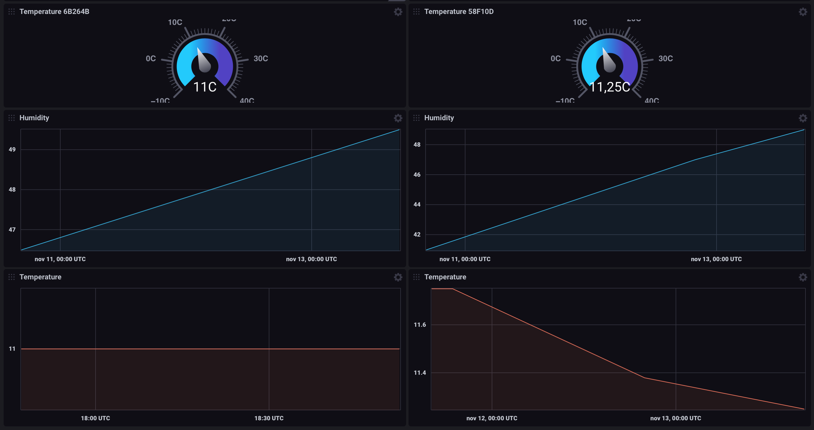

### Shelly H&T stats
Graphing data from Shelly H&T WiFi humidity and temperature devices on InfluxDB  and write to a InfluxDB in InfluxDB Cloud.



References

Shelly H&T:  
https://shelly.cloud/shelly-humidity-and-temperature/

APi Docs:  
https://shelly-api-docs.shelly.cloud/#shelly-h-amp-t

InfluxDB Cloud:  
https://www.influxdata.com/products/influxdb-cloud/

**Config file:**

```python
[shelly]  
token = <Shelly API Token>  
devices = <comma separated list of device ids>  
server = <shelly api server>  
[influx]  
server = <influx server>  
token = <influx api token>  
org = <org name>  
bucket = <bucket name>  
```
